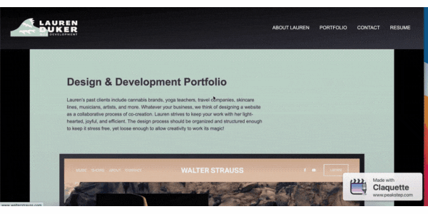

# Lauren Duker Darrimon Portfolio
## Web Development &amp; Design Projects 

#### Jump to: 
* [Description](#description)
* [Link](#link)
* [Methods](#methods)
* [Code](#code)
* [Author](#author)
* [Credits](#credits)

## Description

This site is a simple one page site built with HTML and CSS to display and links to some of Lauren Duker Darrimon's web design work, her resume, and in the future, her web development work. It also has a live contact form to recieve client inquires. 

## Link

[Live Portfolio Site](https://laurendarrimon.github.io/lauren-darrimon-portfolio/)

## Built With

* [HTML](https://www.w3schools.com/html/default.asp)
* [CSS](https://www.w3schools.com/w3css/defaulT.asp)

## Methods 

### HTML
the site was structured using semantic HTML for maximum acessibility. This allows the function of each element to be explicitly stated in its element tag, making it avaialble to those who may not be able to see the design and layout indications of meaning. 

The various form elements make extensive use of attributes to label, match and organize the information that will be coming in from the forms. 

### CSS
The site use CSS for positioning, color, styling, and layout. The bio section is positioned using a CSS flexbox. The individual items in the portfolio section are positioned using a CSS grid. 

### CSS Media Queries
We start from a wide horizontal desktop view. When the screen size drops to  less than 992 px screen width, a standard tablet size, some of the elements will start to stack vertically, rather than side by side. When the screen shrinks even further to a mobile size of 768px screen width or less, almost all elements will swicth to a vertical layout, and blocks of content will display stacked on top of one another. 

 
 

## Author

### Lauren Duker Darrimon 

- [Link to Portfolio Site](https://www.laurenlalita.com)
- [Link to Github](https://github.com/LaurenDarrimon)
- [Link to LinkedIn](https://www.linkedin.com/in/lauren-lalita-duker-9537b1201/)

## Credits

Thanks to [Meyer Web](http://meyerweb.com/eric/tools/css/reset/) for the reset CSS. 
   v2.0 | 20110126
   License: none (public domain)

Thanks to [Formspree](http://formspree.io/) for the free form functionality. 
